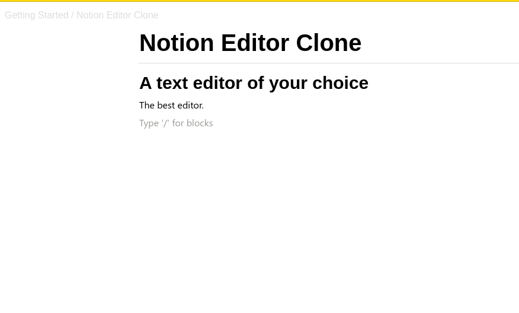
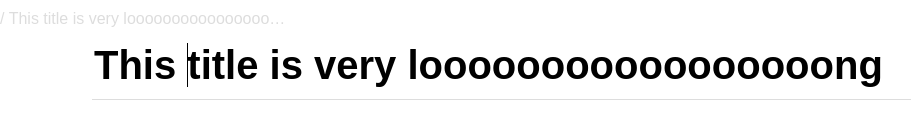

**Notion Rich text editor clone** is a scalable app that allows you to edit text in a very smooth and pleasant way.

## 🛠 Built With <a name="built-with">React.js</a>

## 🚀 Live Demo <a name="live-demo"></a>

- [Live Demo Link](https://638de07f2becdf7c7c6e330a--rich-text-editor-notion.netlify.app/)

## Project Screen Shot(s)

#### Features:

<div align="center">

  
  <br/>

</div>

<div align="center">

  
  <br/>

</div>
#### How to scale:
```
  const BLOCKS_TYPES = [
    // Add blocks here in the folowing format for scalability.
    {
      id: '1',
      iconSrc: './blocks/h1.png',
      name: 'Heading 1',
      shortcut: '1',
      discription: 'type / + 1',
      styling: {
        fontFamily: 'sans-serif, Helvetica, Arial',
        fontWeight: 600,
        fontSize: 30,
        lineHeight: 1.3,
      },
    },
  ];
```
## Installation and Setup Instructions

Clone down this repository. You will need `node` and `npm` installed globally on your machine.

Installation:

`npm install`

To Run Test Suite:

`npm test`

To Start Server:

`npm start`

To Visit App:

`localhost:3000/`

## 🚀 Live Demo <a name="live-demo"></a>

> Add a link to your deployed project.

- [Live Demo Link](https://yourdeployedapplicationlink.com)
